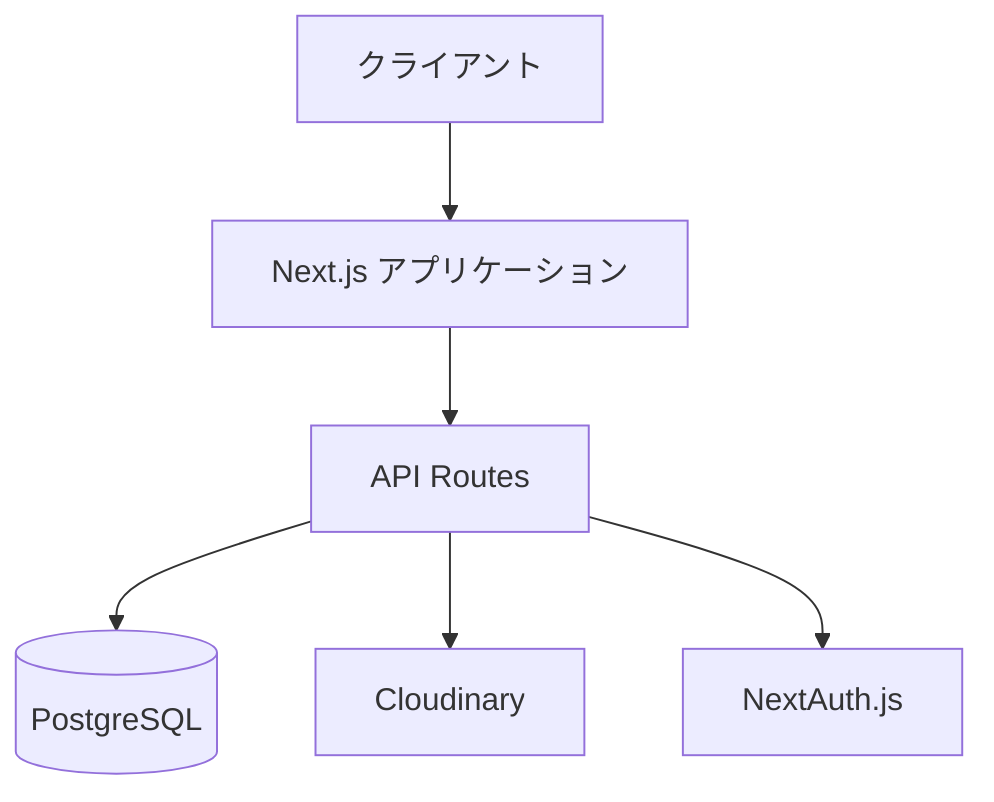
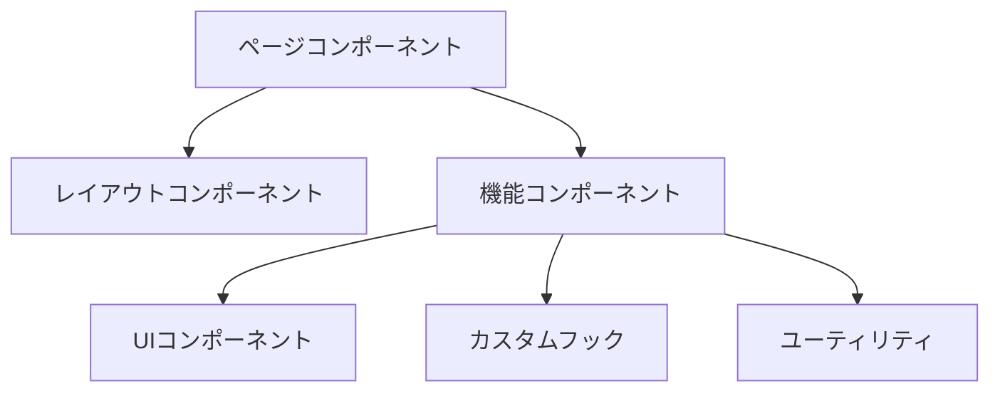
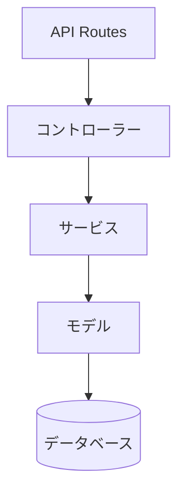

# システムアーキテクチャ設計

## 1. システム全体構成

### 1.1 アーキテクチャ概要

### 1.2 技術スタック
1. フロントエンド
   - Next.js v14.0.0
   - React v18.2.0
   - TypeScript v5.0.0
   - Tailwind CSS v3.4.1

2. バックエンド
   - Next.js API Routes
   - Prisma v5.9.1
   - PostgreSQL v15.0

3. インフラストラクチャ
   - Vercel（ホスティング）
   - Cloudinary（画像ストレージ）
   - NextAuth.js（認証）

## 2. コンポーネント設計

### 2.1 フロントエンド構成

### 2.2 バックエンド構成

## 3. データフロー

### 3.1 リクエストフロー
1. クライアントリクエスト
2. Next.jsルーティング
3. ページレンダリング
4. APIリクエスト
5. データ処理
6. レスポンス返却

### 3.2 データ永続化フロー
1. Prismaモデル定義
2. マイグレーション
3. データベース更新
4. キャッシュ制御

## 4. セキュリティ設計

### 4.1 認証・認可
1. NextAuth.jsによる認証
   - JWTトークン管理
   - セッション管理
   - ロールベースアクセス制御

2. API認証
   - Bearer認証
   - CSRF対策
   - Rate Limiting

### 4.2 データ保護
1. データ暗号化
   - 通信経路の暗号化（HTTPS）
   - 機密データの暗号化（パスワード等）

2. アクセス制御
   - ロールベースアクセス制御
   - リソースベースアクセス制御

## 5. パフォーマンス設計

### 5.1 フロントエンド最適化
1. 画像最適化
   - Cloudinaryによる最適化
   - 遅延読み込み
   - WebP形式の利用

2. バンドル最適化
   - コード分割
   - 動的インポート
   - キャッシュ戦略

### 5.2 バックエンド最適化
1. データベース最適化
   - インデックス設計
   - クエリ最適化
   - コネクションプール

2. キャッシュ戦略
   - ステイルワイルリバリデート
   - エッジキャッシュ
   - メモリキャッシュ

## 6. スケーラビリティ設計

### 6.1 水平スケーリング
1. Vercelによる自動スケーリング
2. データベースレプリケーション
3. CDNの活用

### 6.2 垂直スケーリング
1. リソース最適化
2. パフォーマンスチューニング
3. データベース最適化

## 7. 監視設計

### 7.1 アプリケーション監視
1. エラー監視
2. パフォーマンス監視
3. ユーザー行動分析

### 7.2 インフラ監視
1. リソース監視
2. 可用性監視
3. セキュリティ監視 