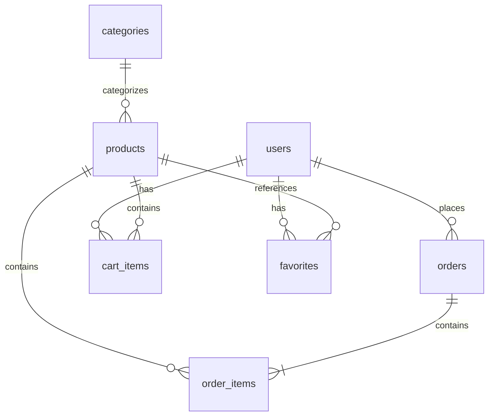

# データベース設計書

## 1. 論理データモデル

### 1.1 エンティティ関連図（ER図）


### 1.2 エンティティ一覧
1. users（ユーザー）
2. products（商品）
3. categories（カテゴリー）
4. orders（注文）
5. order_items（注文明細）
6. cart_items（カート内アイテム）
7. favorites（お気に入り）

## 2. テーブル定義

### 2.1 users
| カラム名 | データ型 | NULL | キー | 説明 |
|---------|---------|------|------|------|
| id | uuid | NO | PK | ユーザーID |
| email | varchar(255) | NO | UQ | メールアドレス |
| password_hash | varchar(255) | NO | - | パスワードハッシュ |
| first_name | varchar(50) | NO | - | 名 |
| last_name | varchar(50) | NO | - | 姓 |
| phone | varchar(20) | YES | - | 電話番号 |
| role | varchar(20) | NO | - | ロール（user/admin） |
| created_at | timestamp | NO | - | 作成日時 |
| updated_at | timestamp | NO | - | 更新日時 |

### 2.2 products
| カラム名 | データ型 | NULL | キー | 説明 |
|---------|---------|------|------|------|
| id | uuid | NO | PK | 商品ID |
| category_id | uuid | NO | FK | カテゴリーID |
| name | varchar(100) | NO | - | 商品名 |
| description | text | YES | - | 商品説明 |
| price | decimal(10,2) | NO | - | 価格 |
| stock | integer | NO | - | 在庫数 |
| image_url | varchar(255) | YES | - | 商品画像URL |
| status | varchar(20) | NO | - | ステータス |
| created_at | timestamp | NO | - | 作成日時 |
| updated_at | timestamp | NO | - | 更新日時 |

### 2.3 categories
| カラム名 | データ型 | NULL | キー | 説明 |
|---------|---------|------|------|------|
| id | uuid | NO | PK | カテゴリーID |
| name | varchar(50) | NO | - | カテゴリー名 |
| description | text | YES | - | 説明 |
| created_at | timestamp | NO | - | 作成日時 |
| updated_at | timestamp | NO | - | 更新日時 |

### 2.4 orders
| カラム名 | データ型 | NULL | キー | 説明 |
|---------|---------|------|------|------|
| id | uuid | NO | PK | 注文ID |
| user_id | uuid | NO | FK | ユーザーID |
| status | varchar(20) | NO | - | 注文状態 |
| total_amount | decimal(10,2) | NO | - | 合計金額 |
| shipping_address | text | NO | - | 配送先住所 |
| payment_method | varchar(50) | NO | - | 支払方法 |
| created_at | timestamp | NO | - | 作成日時 |
| updated_at | timestamp | NO | - | 更新日時 |

### 2.5 order_items
| カラム名 | データ型 | NULL | キー | 説明 |
|---------|---------|------|------|------|
| id | uuid | NO | PK | 注文明細ID |
| order_id | uuid | NO | FK | 注文ID |
| product_id | uuid | NO | FK | 商品ID |
| quantity | integer | NO | - | 数量 |
| price | decimal(10,2) | NO | - | 価格 |
| created_at | timestamp | NO | - | 作成日時 |
| updated_at | timestamp | NO | - | 更新日時 |

### 2.6 cart_items
| カラム名 | データ型 | NULL | キー | 説明 |
|---------|---------|------|------|------|
| id | uuid | NO | PK | カートアイテムID |
| user_id | uuid | NO | FK | ユーザーID |
| product_id | uuid | NO | FK | 商品ID |
| quantity | integer | NO | - | 数量 |
| created_at | timestamp | NO | - | 作成日時 |
| updated_at | timestamp | NO | - | 更新日時 |

### 2.7 favorites
| カラム名 | データ型 | NULL | キー | 説明 |
|---------|---------|------|------|------|
| id | uuid | NO | PK | お気に入りID |
| user_id | uuid | NO | FK | ユーザーID |
| product_id | uuid | NO | FK | 商品ID |
| created_at | timestamp | NO | - | 作成日時 |
| updated_at | timestamp | NO | - | 更新日時 |

## 3. インデックス設計

### 3.1 users
| インデックス名 | カラム | 種類 | 説明 |
|--------------|-------|------|------|
| users_pkey | id | PRIMARY | 主キー |
| users_email_idx | email | UNIQUE | メールアドレス検索用 |

### 3.2 products
| インデックス名 | カラム | 種類 | 説明 |
|--------------|-------|------|------|
| products_pkey | id | PRIMARY | 主キー |
| products_category_id_idx | category_id | BTREE | カテゴリー検索用 |
| products_name_idx | name | BTREE | 商品名検索用 |

### 3.3 orders
| インデックス名 | カラム | 種類 | 説明 |
|--------------|-------|------|------|
| orders_pkey | id | PRIMARY | 主キー |
| orders_user_id_idx | user_id | BTREE | ユーザー検索用 |
| orders_status_idx | status | BTREE | ステータス検索用 |

## 4. 外部キー制約

### 4.1 products
```sql
ALTER TABLE products
ADD CONSTRAINT fk_products_category
FOREIGN KEY (category_id)
REFERENCES categories(id)
ON DELETE RESTRICT;
```

### 4.2 orders
```sql
ALTER TABLE orders
ADD CONSTRAINT fk_orders_user
FOREIGN KEY (user_id)
REFERENCES users(id)
ON DELETE RESTRICT;
```

### 4.3 order_items
```sql
ALTER TABLE order_items
ADD CONSTRAINT fk_order_items_order
FOREIGN KEY (order_id)
REFERENCES orders(id)
ON DELETE CASCADE;

ALTER TABLE order_items
ADD CONSTRAINT fk_order_items_product
FOREIGN KEY (product_id)
REFERENCES products(id)
ON DELETE RESTRICT;
```

## 5. パーティション設計

### 5.1 orders
- パーティション方式：RANGE
- パーティションキー：created_at
- パーティション期間：月次

```sql
CREATE TABLE orders (
    -- カラム定義
) PARTITION BY RANGE (created_at);

CREATE TABLE orders_202401 PARTITION OF orders
    FOR VALUES FROM ('2024-01-01') TO ('2024-02-01');
```

## 6. バックアップ設計

### 6.1 バックアップ方式
1. 論理バックアップ（pg_dump）
   - 実行頻度：日次
   - 保存期間：7日間
   - 実行時間：深夜1時

2. 物理バックアップ
   - 実行頻度：週次
   - 保存期間：4週間
   - 実行時間：日曜日深夜2時

### 6.2 リカバリ手順
1. 最新のバックアップを取得
2. WALファイルの適用
3. データベースのリストア
4. 整合性チェック 