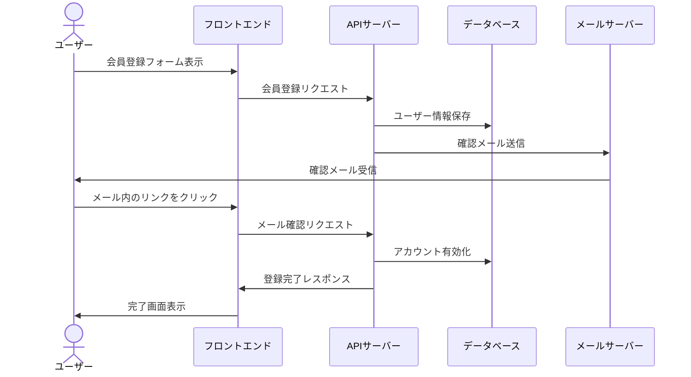
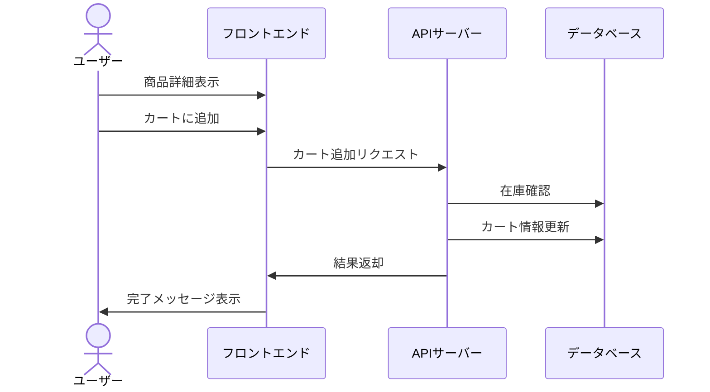
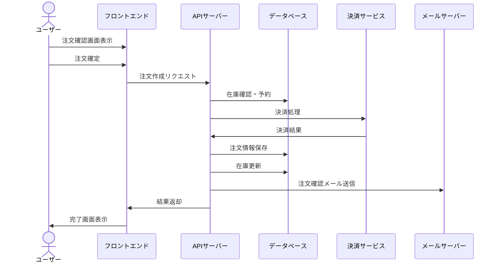
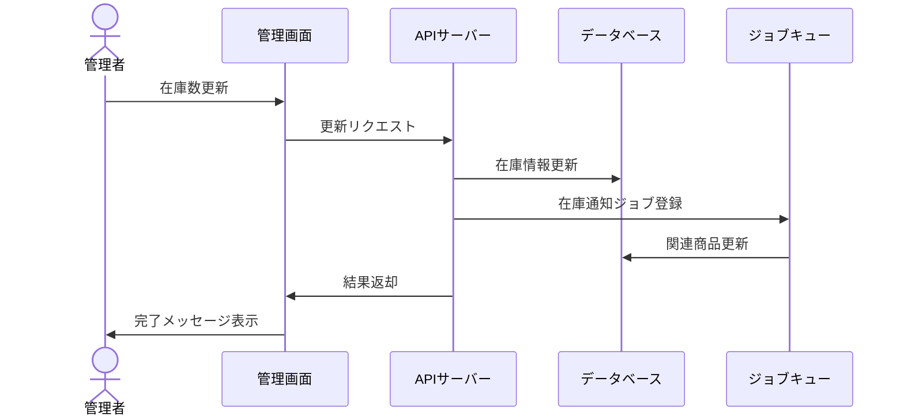
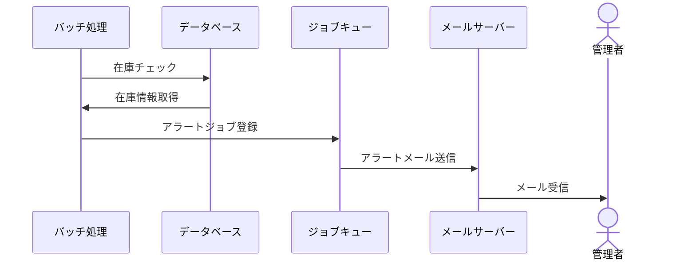
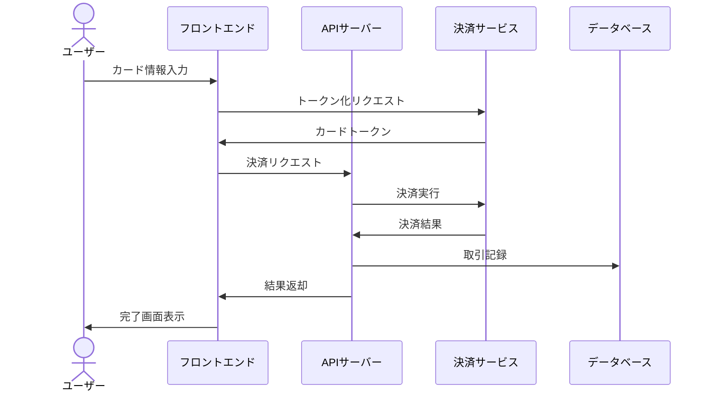
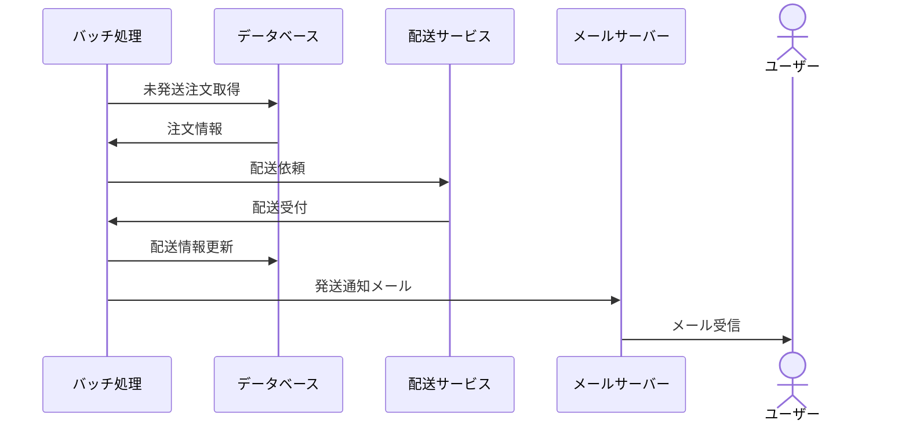
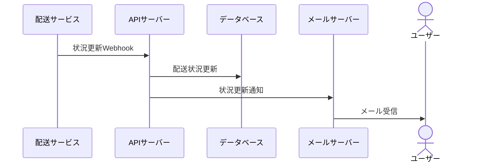

# プロセスフロー設計書

## 1. 会員登録プロセス

### 1.1 会員登録フロー

### 1.2 エラーハンドリング
1. メールアドレス重複
2. バリデーションエラー
3. メール送信失敗
4. 確認期限切れ

## 2. 商品購入プロセス

### 2.1 カート追加フロー

### 2.2 注文処理フロー

## 3. 在庫管理プロセス

### 3.1 在庫更新フロー

### 3.2 在庫アラートフロー

## 4. 決済処理プロセス

### 4.1 クレジットカード決済フロー

### 4.2 決済エラーハンドリング
1. カード情報無効
2. 残高不足
3. 決済サービス障害
4. タイムアウト

## 5. 配送管理プロセス

### 5.1 配送手配フロー

### 5.2 配送状況更新フロー

## 6. バッチ処理プロセス

### 6.1 日次バッチ処理
1. 在庫確認・通知
2. 注文ステータス更新
3. 売上集計
4. データバックアップ

### 6.2 週次バッチ処理
1. 商品レコメンド更新
2. アクセス解析
3. パフォーマンスレポート
4. メンテナンス処理

## 7. エラー処理プロセス

### 7.1 システムエラー対応
1. エラーログ記録
2. 管理者通知
3. 自動リトライ
4. フォールバック処理

### 7.2 業務エラー対応
1. ユーザー通知
2. 代替フロー提案
3. 手動対応依頼
4. 状態復旧処理 